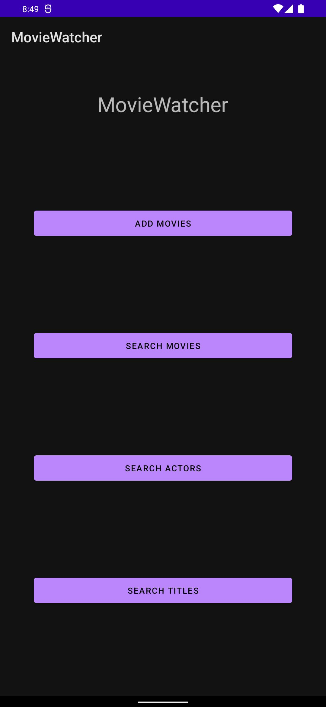

<div align = "center">

<h1><a href="https://2kabhishek.github.io/MovieWatcher">MovieWatcher</a></h1>

<a href="https://github.com/2KAbhishek/MovieWatcher/blob/main/LICENSE">
 </a>

<a href="https://github.com/2KAbhishek/MovieWatcher/pulse">
 </a>

<a href="https://github.com/2KAbhishek/MovieWatcher/stargazers">
</a>

<a href="https://github.com/2KAbhishek/MovieWatcher/network/members">
 </a>

<a href="https://github.com/2KAbhishek/MovieWatcher/watchers">
 </a>

<a href="https://github.com/2KAbhishek/MovieWatcher/graphs/contributors">
 </a>

<a href="https://github.com/2KAbhishek?tab=followers">
 </a>

<h3>Learn about your favourite movies 🎟🎥</h3>

<figure>
  
  <br/>
  <figcaption>MovieWatcher screenshot</figcaption>
</figure>

</div>

## What is this

MovieWatcher is a feature packed application that allows you to search for movies, actors and all related information.
Uses OMDB API to fetch data.
Also has a built-in database that stores your favourite movies.

## Inspiration

Wanted to explore the OMDB API.

## Prerequisites

Before you begin, ensure you have met the following requirements:

- You have installed the latest version of `Android Studio` and `OMDB API Key`

## Getting MovieWatcher

To install MovieWatcher, follow these steps:

```bash
git clone https://github.com/2kabhishek/MovieWatcher
cd MovieWatcher
```

## How it was built

MovieWatcher was built using `Android Studio`, `OMDB API` and `Kotlin`

## Challenges faced

Figuring out the App design and UI.

## What I learned

- Learned a lot about Android UI design.
- Worked with `OMDB API`
- DAO's and database interaction with Kotlin.

## What's next

Add image support.

Hit the ⭐ button if you found this useful.

## More Info

<div align="center">

<a href="https://github.com/2KAbhishek/MovieWatcher">Source</a> | <a href="https://2kabhishek.github.io/MovieWatcher">Website</a>

</div>
